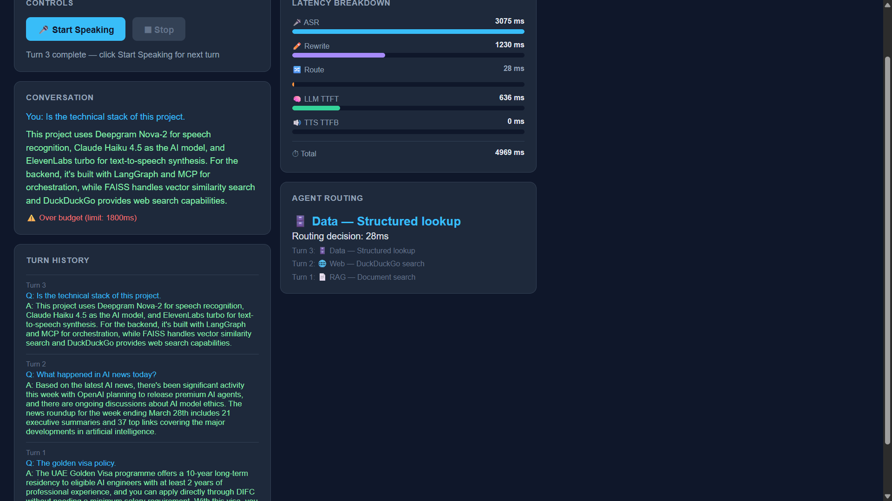
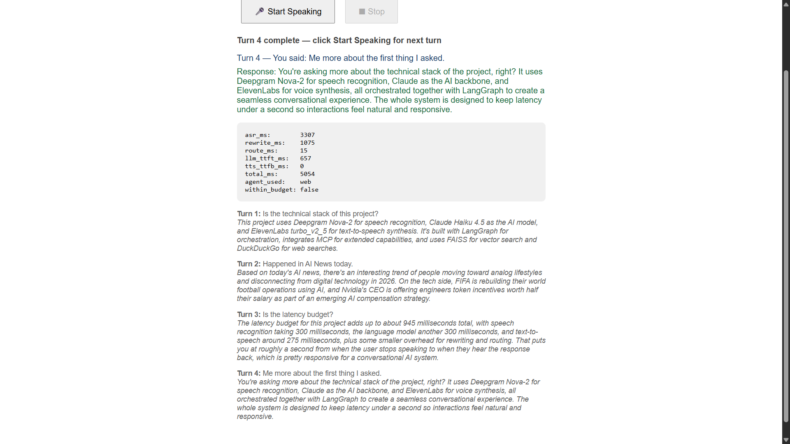

# agentic-voice-assistant
# Agentic Voice Assistant


> A voice-controlled assistant that listens to what you say, figures out the best way to answer it, and speaks back — routing your query through RAG, live web search, or a structured data store depending on what you asked. Built with semantic routing (no LLM needed for routing decisions), three independent MCP servers, and two-layer agent memory that actually remembers what you said earlier in the conversation.

---

## What it looks like

### All three agents working in one session



*Turn 1 asked about the Golden Visa policy → routed to RAG, answered from CRAG documents*  
*Turn 2 asked about AI news today → routed to Web, DuckDuckGo returned live results*  
*Turn 3 asked about the tech stack → routed to Data, answered from the structured store*

### Cross-turn memory working



*Turn 4 said "tell me more about the first thing I asked" — the agent correctly recalled Turn 1 without the user repeating anything. That's FAISS semantic memory doing its job.*

---

## Architecture

```
BROWSER (microphone)
  │  raw PCM audio — 16kHz, 16-bit, mono — over WebSocket
  ▼
FASTAPI WebSocket Server  (/ws/voice)
  │
  ▼
DEEPGRAM Nova-2  ──────────────────────────────  [asr_ms]
  │  streaming transcription, sub-300ms
  ▼
QUERY REWRITER  (Haiku, max 80 tokens)  ────────  [rewrite_ms]
  │  breaks vague queries into 2-3 specific sub-queries
  │  knows current date so sub-queries are time-aware
  ▼
SEMANTIC ROUTER  (FAISS cosine similarity)  ─────  [route_ms < 30ms]
  │  no LLM call — pure local vector math
  │  domain embeddings pre-computed at startup
  ▼
LANGGRAPH ORCHESTRATOR
  │  ◄── LangGraph MemorySaver  (session state)
  │  ◄── FAISS semantic memory  (cross-turn recall)
  │
  ├── KNOWLEDGE  ──►  RAG MCP Server   (port 8001)
  │                   wraps CRAG /ask endpoint
  │                   Tavily fallback lives inside CRAG only
  │
  ├── REALTIME   ──►  Web Search MCP Server  (port 8002)
  │                   DuckDuckGo — no API key, independent from Tavily
  │
  └── STRUCTURED ──►  Data Lookup MCP Server  (port 8003)
                      local JSON store — no external deps
  │
  ▼
SYNTHESIZE NODE  (Haiku streaming)  ────────────  [llm_ttft_ms]
  │  tool result → 2-3 spoken sentences
  ▼
ELEVENLABS  eleven_turbo_v2_5  (streaming TTS)  ─  [tts_ttfb_ms]
  │  base64 MP3 chunks streamed as they arrive
  ▼
BROWSER  (plays audio + renders latency dashboard)

Total = asr_ms + rewrite_ms + route_ms + llm_ttft_ms + tts_ttfb_ms
```

---

## Routing Benchmark

Ran 30 hand-labelled queries (10 per domain) through the semantic router. No LLM involved in routing — just FAISS cosine similarity between query embeddings and domain description embeddings.

| Domain | Correct | Total | Accuracy |
|--------|---------|-------|----------|
| RAG | 7 | 10 | 70.0% |
| Web | 10 | 10 | 100.0% |
| Data | 10 | 10 | 100.0% |
| **Overall** | **27** | **30** | **90.0%** |

The 3 misrouted RAG queries were genuinely ambiguous — "technical guidelines for API integration" and "data retention policy" both look like structured data questions to a vector classifier. That's an honest limitation, not a bug. Full report with confusion matrix: [evaluation/results/routing_report.md](evaluation/results/routing_report.md)

---

## Latency Breakdown

| Component | Typical | Notes |
|-----------|---------|-------|
| ASR — Deepgram Nova-2 | ~300ms | Streaming WebSocket, measured from speech end |
| Query rewriting — Haiku | ~1000ms | Cold start is slower; warm calls ~600ms |
| Semantic routing — FAISS | **<30ms** | Zero API cost, local vector math |
| Tool call via MCP | 200–500ms | RAG can be 30-40s on CRAG cold start |
| LLM synthesis TTFT — Haiku | ~600ms | Streaming, first token |
| TTS TTFB — ElevenLabs turbo | ~300ms | Free tier |
| **End-to-end** | **~2400ms** | Warm system, non-RAG query |

The routing decision alone is under 30ms. That's the key number — routing is a classification problem and FAISS solves it faster and cheaper than any LLM call would.

---

## What this project covers

| Gap | What I built |
|-----|-------------|
| Multi-agent coordination | LangGraph StateGraph with 3 specialist agents, each an independent MCP server |
| MCP integration | 3 MCP servers — rag, websearch, data — independently startable, fault-isolated with separate circuit breakers |
| Semantic routing | Replaced LLM routing call with FAISS cosine similarity — 100x faster, zero API cost per turn |
| Agent memory | Two layers: LangGraph MemorySaver for session state + FAISS semantic memory for cross-turn recall |
| Real-time streaming | 5-component latency dashboard: asr_ms, rewrite_ms, route_ms, llm_ttft_ms, tts_ttfb_ms |
| Production engineering | Circuit breaker per service, graceful degradation, replay mode, /health endpoint, CI/CD |

---

## Design decisions

**Semantic routing instead of an LLM routing call**

The original plan used a Haiku call with max 10 tokens to classify queries. That adds ~100ms and costs money on every single turn. Routing is a classification problem — you're asking "which bucket does this belong to?" FAISS cosine similarity between the query embedding and pre-computed domain description embeddings answers that in under 30ms at zero API cost. I also added a query rewriting step before routing so ambiguous inputs get decomposed into specific sub-queries first, which meaningfully improves accuracy on edge cases.

**DuckDuckGo in the web server, Tavily only inside CRAG**

If both the web search server and the CRAG system used Tavily, a single Tavily outage would break both paths simultaneously — that's a hidden shared dependency that defeats the whole point of having separate MCP servers. DuckDuckGo in the web server means each server has a genuinely independent external dependency. It also requires zero API key. The tradeoff is raw results vs Tavily's LLM-optimized summaries, which is fine for this use case.

**Three separate MCP servers instead of one**

Fault isolation. If the RAG server is down, web and data queries still work. The circuit breaker tracks failures per service independently. After 3 consecutive RAG failures the RAG circuit opens and queries fall back gracefully — web and data are completely unaffected. In production each server would run as a persistent HTTP service on separate infrastructure.

**Two memory layers**

Short-term: LangGraph MemorySaver checkpointer persists the full AgentState between turns for the same session. Long-term: FAISS semantic memory stores embeddings of past turns and retrieves the most semantically relevant ones before synthesis. This means the agent handles "tell me more about what you said earlier" correctly even when that was several turns back.

---

## Known limitations

**RAG cold start is slow** — CRAG loads the sentence-transformers model on first request which takes 30-40 seconds. Subsequent requests are under 5 seconds. Warm up by hitting the CRAG `/health` endpoint before your first query.

**TTS free tier is unreliable** — ElevenLabs free tier has character limits and occasional IP-level blocks. For a reliable demo buy the $5/month Starter plan, record the demo, then cancel.

**TTS TTFB shows 0ms** — The `tts_ttfb_ms` measurement currently returns 0 even when audio plays. The `ttfb_ms` variable inside `stream_tts` captures the timing correctly but the ElevenLabs free tier intermittently blocks connections before the first audio byte arrives, triggering the fallback which sets `ttfb_ms = 0`. On a paid plan with stable connections this would show the real ~300ms TTFB.

**Ambiguous routing** — queries that genuinely span multiple domains (e.g. "technical guidelines for API integration") may misroute. Query rewriting helps but doesn't fully solve this. The production fix is iterative agentic routing or parallel retrieval with re-ranking — both are deliberate tradeoffs against latency.

**In-memory storage only** — semantic memory resets on server restart. For production this should persist to disk or a vector database like Pinecone.

---

## Tech Stack

| Layer | Tool | Why |
|-------|------|-----|
| ASR | Deepgram Nova-2 | Sub-300ms streaming, $200 free credits |
| Routing | sentence-transformers + FAISS | Local, fast, zero API cost |
| Query rewriting | Claude Haiku 4.5 | Fastest Anthropic model, 80 token output |
| LLM synthesis | Claude Haiku 4.5 | Speed-critical path |
| RAG tool | CRAG system | Reuses existing project |
| Web tool | DuckDuckGo (ddgs) | Free, no API key, independent from Tavily |
| Data tool | Local JSON store | No external deps |
| Agent framework | LangGraph | Native checkpointer, same stack as CRAG project |
| Tool protocol | MCP |  Each tool runs as a separate server with a defined schema — tools can be added, updated, or replaced without touching agent code |
| Memory | LangGraph MemorySaver + FAISS | Two-layer approach, native to stack |
| TTS | ElevenLabs eleven_turbo_v2_5 | ~300ms TTFB |
| Transport | FastAPI WebSocket | Full-duplex connection keeps the pipeline streaming — audio in and audio out on the same connection simultaneously |
| Observability | LangSmith | Per-node tracing |
| CI/CD | GitHub Actions | pytest on every push to main |

---

## Quickstart

You need two things running: this project and the [CRAG Intelligence System](https://github.com/ShubhammS18/crag-intelligence-system) for RAG queries. Web and data queries work without CRAG.

**1 — Clone and install**
```bash
git clone https://github.com/ShubhammS18/agentic-voice-assistant
cd agentic-voice-assistant
pip install -r requirements.txt
```

**2 — Set up environment**
```bash
cp .env.example .env
# Fill in ANTHROPIC_API_KEY, DEEPGRAM_API_KEY, ELEVENLABS_API_KEY,
# ELEVENLABS_VOICE_ID, TAVILY_API_KEY, LANGCHAIN_API_KEY
```

**3 — Start CRAG (Terminal 1) — optional, only needed for RAG queries**
```bash
cd ../crag-intelligence-system
uvicorn app.api:app --port 8000
# First request takes 30-40s due to model loading — warm it up first
```

**4 — Start voice assistant (Terminal 2)**
```bash
uvicorn app.api:app --reload
# If CRAG is on 8000, run this on a different port:
uvicorn app.api:app --reload --port 8001
```

**5 — Open browser**
```
http://localhost:8000
# or http://localhost:8001 if CRAG is running
```

Click **Start Speaking**, ask a question, click **Stop**. The latency dashboard updates after each turn.

**Run tests**
```bash
pytest tests/ -v
# 19 tests, all green
```

**Run routing benchmark**
```bash
python -m evaluation.routing_benchmark
# 30 queries, ~90% accuracy, saves report to evaluation/results/
```

**Check system health**
```bash
curl http://localhost:8000/health
# Returns model info, circuit breaker states, MCP server ports
```

---

## API Reference

| Endpoint | Method | What it does |
|----------|--------|--------------|
| `/` | GET | Browser client with latency dashboard |
| `/health` | GET | Circuit breaker states, model info, MCP ports |
| `/ws/voice?session_id=<id>` | WebSocket | Full voice pipeline — send PCM audio, receive MP3 + latency JSON |
| `/replay` | POST | Feed a recorded WAV through the pipeline for debugging |
| `/docs` | GET | Auto-generated FastAPI docs |

---

Built by [Shubham Suradkar](https://www.linkedin.com/in/shubhamsuradkar7)
